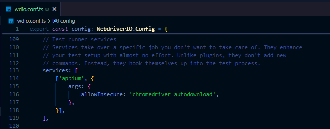

# Appium Mobile Testing

Este proyecto utiliza **Appium** y **WebdriverIO** para realizar pruebas automatizadas en dispositivos móviles Android con el navegador Chrome.

## Requisitos previos

Antes de comenzar, asegúrate de tener instalados los siguientes requerimientos:

1. **Node.js** (versión 16 o superior) y npm.
   - Descárgalo desde [Node.js](https://nodejs.org/).
2. **Java Development Kit (JDK)**.
   - Descárgalo desde [Oracle](https://www.oracle.com/java/technologies/javase-downloads.html) o usa OpenJDK.
   - Asegúrate de configurar la variable de entorno `JAVA_HOME`.
3. **Android SDK**.
   - Descárgalo desde [Android Studio](https://developer.android.com/studio).
   - Configura las variables de entorno `ANDROID_HOME` y agrega `platform-tools` al `PATH`.
4. **Appium** (versión 2.x).
   - Instalado como dependencia del proyecto o globalmente.
   - Si lo instalas globalmente deberás incluir esta config a tu wdio.conf.ts:
   ```bash
      services: [
         ['appium', {
               command: 'appium', // Usa el comando global si Appium está instalado globalmente
         }],
      ],
   ```
5. Los drivers de appium contienen **appium doctor** integrado por lo que al instalar por ejemplo, appium-uiautomator2-driver, puedes ejecutar doctor con el siguiente comando:

   ```bash
   appium driver doctor uiautomator2
   ```

## Instalación

Sigue estos pasos para configurar el proyecto:

1. Clona este repositorio:

   ```bash
   git clone https://github.com/aldimhernandez/appium-mobile-testing.git
   cd appium-mobile-testing
   ```

2. Instala las dependencias del proyecto

   ```bash
      npm i
   ```

## Configuración

1. El archivo de configuración principal es `wdio.conf.ts`. Asegúrate de que las capabilities estén configuradas correctamente para tu dispositivo/emulador. Por ejemplo:

   ```bash
         capabilities: [{
             platformName: 'Android',
             browserName: 'Chrome',
             browserVersion: '128.0.6613',
             'appium:deviceName': 'Android GoogleAPI Emulator',
             'appium:platformVersion': '16.0',
             'appium:automationName': 'UiAutomator2',
             'appium:chromedriverExecutableDir': './chromedriver-mobile',
         }],
   ```

## Ejecución de pruebas

1. **Levanta un emulador de Android desde Android Studio**:

   - Abre Android Studio y ve a la sección **Device Manager**.
   - Crea un emulador si no tienes uno configurado.
   - Asegúrate de que el emulador esté ejecutándose antes de iniciar las pruebas.
   - También asegúrate de que los detalles de la versión emulada coincidan con las capabilities configuradas.

2. **Inicia el servidor Appium**:

   ```bash
   npx appium
   ```

3. **Ejecuta las pruebas con WebdriverIO**:

   ```bash
   npx wdio run wdio.conf.ts
   ```

   ó con el script:

   ```bash
   npm run test
   ```

## Solución de posibles errores

Si al ejecutar los test encuentras errores con las versiones de chrome, asegúrate de que este habilitada la descarga automática de versiones de chrome:



También puedes configurar Appium server para habilitar la descarga automática de Chromedriver (opcional):

```bash
 appium --allow-insecure chromedriver_autodownload
```

## Recursos adicionales

- [Documentación de Appium](https://appium.io/docs/en/latest/)
- [Documentación de WebdriverIO](https://webdriver.io/es/)
- [Descargas de Chromedriver](https://chromedriver.chromium.org/downloads)
